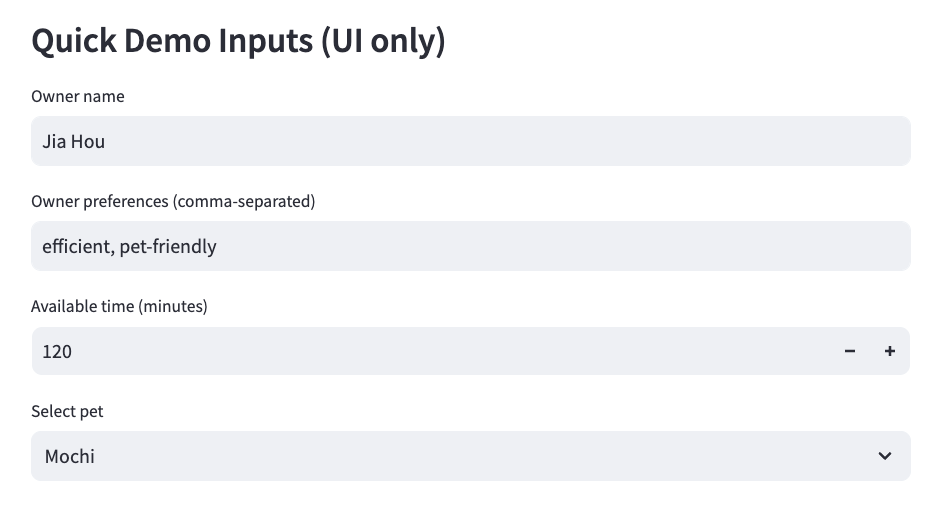
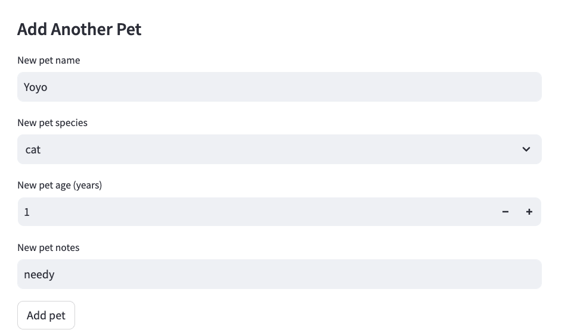
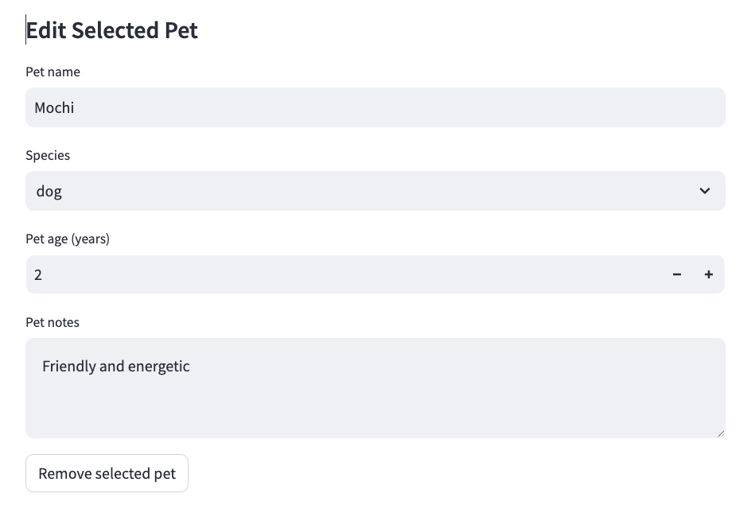
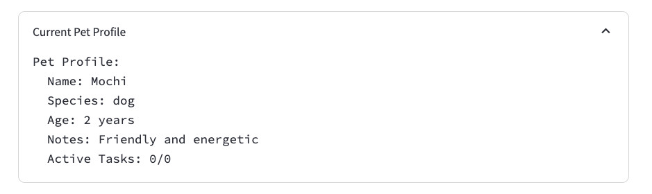
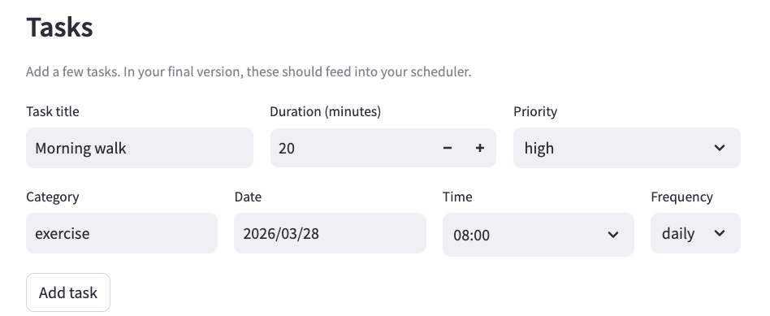
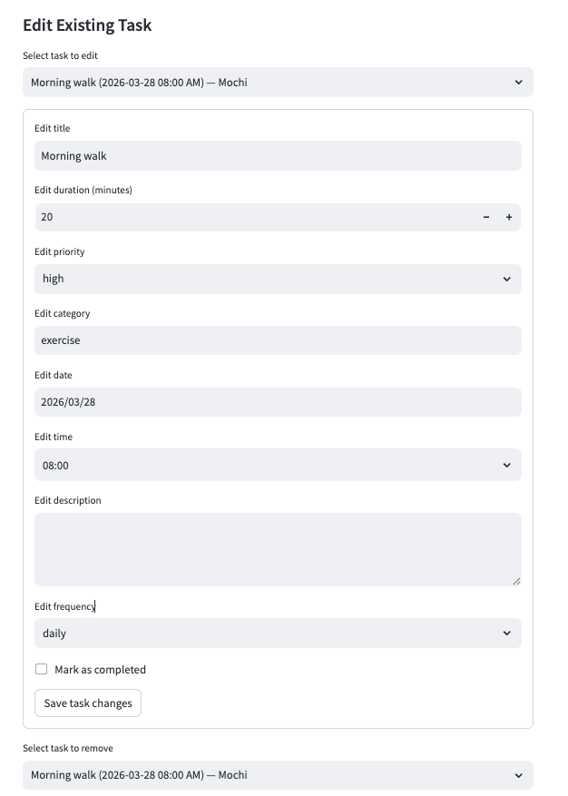
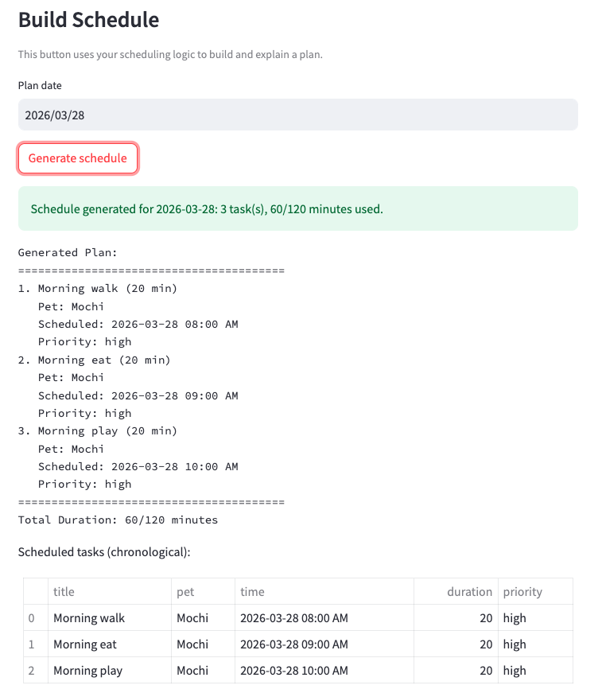

# PawPal+ (Module 2 Project)

You are building **PawPal+**, a Streamlit app that helps a pet owner plan care tasks for their pet.

## Scenario

A busy pet owner needs help staying consistent with pet care. They want an assistant that can:

- Track pet care tasks (walks, feeding, meds, enrichment, grooming, etc.)
- Consider constraints (time available, priority, owner preferences)
- Produce a daily plan and explain why it chose that plan

Your job is to design the system first (UML), then implement the logic in Python, then connect it to the Streamlit UI.

## What you will build

Your final app should:

- Let a user enter basic owner + pet info
- Let a user add/edit tasks (duration + priority at minimum)
- Generate a daily schedule/plan based on constraints and priorities
- Display the plan clearly (and ideally explain the reasoning)
- Include tests for the most important scheduling behaviors

## Getting started

### Setup

```bash
python -m venv .venv
source .venv/bin/activate  # Windows: .venv\Scripts\activate
pip install -r requirements.txt
```

### Suggested workflow

1. Read the scenario carefully and identify requirements and edge cases.
2. Draft a UML diagram (classes, attributes, methods, relationships).
3. Convert UML into Python class stubs (no logic yet).
4. Implement scheduling logic in small increments.
5. Add tests to verify key behaviors.
6. Connect your logic to the Streamlit UI in `app.py`.
7. Refine UML so it matches what you actually built.

## Smarter Scheduling

The scheduler now includes smarter planning features:

- **Sort** tasks by priority and timing so critical care items are planned first.
- **Filter** tasks using constraints and preferences to keep schedules practical.
- **Detect conflicts** when tasks overlap or exceed available time.
- **Handle recurring tasks** so repeat routines are automatically included.

## Testing PawPal+

Run the full test suite with:

```bash
python -m pytest
```

Current tests cover core scheduler reliability areas, including:

- Sorting correctness (chronological ordering of scheduled tasks)
- Recurrence logic (daily/weekly tasks creating next occurrences)
- Conflict detection (duplicate-time warnings across same/different pets)
- Edge cases (midnight/noon ordering, invalid/missing times, non-recurring tasks)

**Confidence Level:** ★★★★★ (5/5)

Based on the latest test run (`python -m pytest`), all tests passed.

## Features

Implemented algorithms and scheduling behaviors:

- **Priority + duration scheduling:** Sorts incomplete tasks by priority (`high` → `medium` → `low`) and then by shorter duration first.
- **Available-time bounded planning:** Greedily adds tasks only while total planned duration stays within the owner's available minutes.
- **Chronological sorting:** Returns generated plans in time order using AM/PM-aware parsing.
- **Time conflict warnings:** Detects same-time task conflicts and generates human-readable warnings.
- **Cross-pet conflict scope:** Labels conflicts as `same pet` or `different pets` when task-to-pet mapping is available.
- **Invalid-time resilience:** Skips malformed time values safely and reports warnings instead of failing.
- **Daily/weekly recurrence:** Completing `daily` or `weekly` tasks automatically creates the next pending occurrence.
- **Date-aware recurrence shifting:** If a task time includes a date, recurrence moves forward by +1 day (daily) or +7 days (weekly).
- **Task filtering:** Supports filtering tasks by completion status and by pet name.

## 📸 Demo

### 1) Quick Owner & Pet Setup



### 2) Build Your Pet Profile





### 3) Manage Care Tasks




### 4) Generate a Smart Daily Plan


