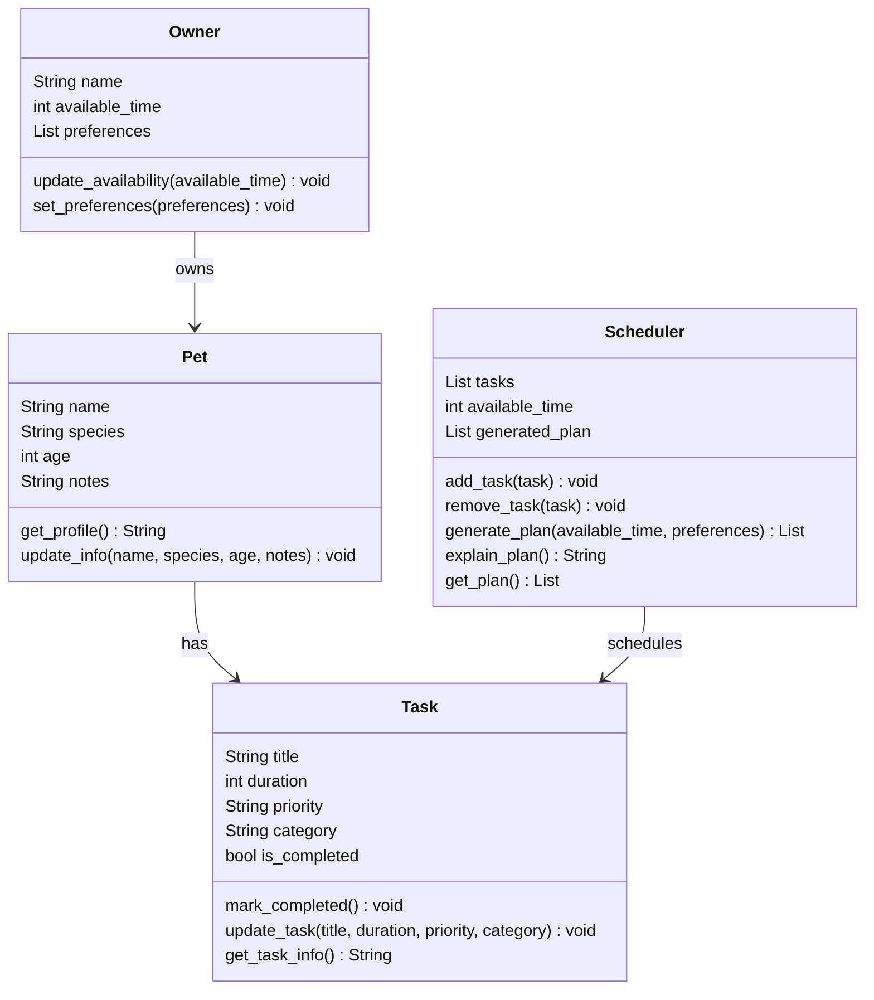

## Class Diagram

```mermaid
classDiagram
	class Pet {
		String name
		String species
		int age
		String notes
		get_profile() String
		update_info(name, species, age, notes) void
	}

	class Owner {
		String name
		int available_time
		List preferences
		update_availability(available_time) void
		set_preferences(preferences) void
	}

	class Task {
		String title
		int duration
		String priority
		String category
		bool is_completed
		mark_completed() void
		update_task(title, duration, priority, category) void
		get_task_info() String
	}

	class Scheduler {
		List tasks
		int available_time
		List generated_plan
		add_task(task) void
		remove_task(task) void
		generate_plan(available_time, preferences) List
		explain_plan() String
		get_plan() List
	}

	Owner --> Pet : owns
	Pet --> Task : has
	Scheduler --> Task : schedules
```
